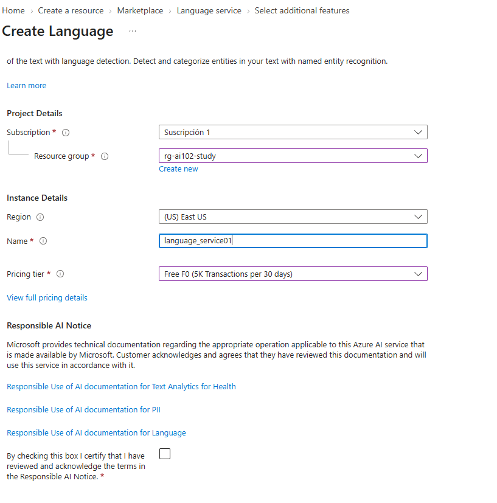

# Execute Language Service Scripts

## Create Language Service Resource

In the azure portal and select Create a Resource and search for "language service"


Enter the values and  create the resource




## Create Language Service Endpoint Variable and Key in .env file

Go to language Service Resource and copy the endpoint and add it to the .env file, go to keys and endpoint and copy the key and update it in the .env file

```
LANGUAGE_ENDPOINT="<endpoint>"
LANGUAGE_KEY="<key from ai-resrce>"
```
  
## Execute the PII Script

```
 python ./run_model/pii_exercise.py
```


## Execute AI query scripot

```
 python ./language_service/run_query_example.py
```


## Execute Language detection script

```
python ./language_service/run_language_detection.py
```