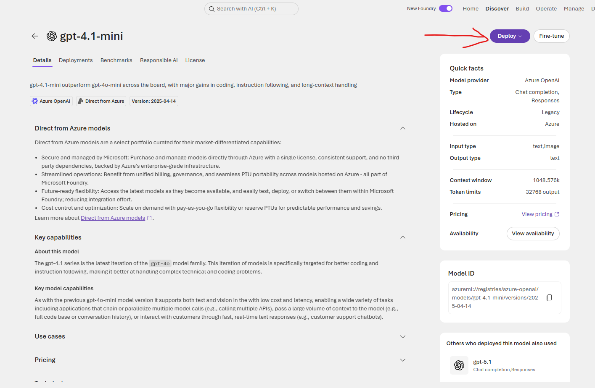
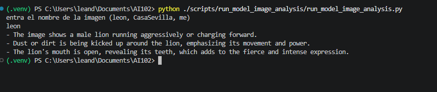

# How to execute run_model_image_analysis.py

## Deploy Model if not visible

look for gpt-4.1-mini model


Deploy Model if there is not an instance



## Execute script

```
python ./scripts/run_model_image_analysis/run_model_image_analysis.py
```

Expected result should look like this if option selected is "leon"

