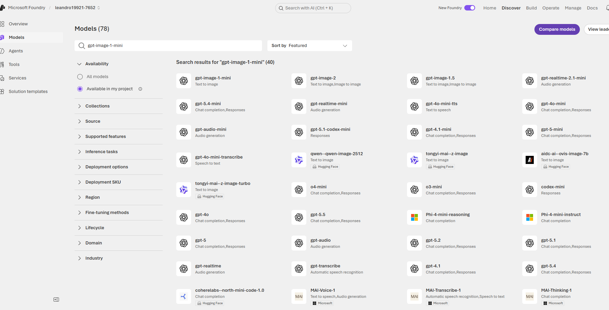
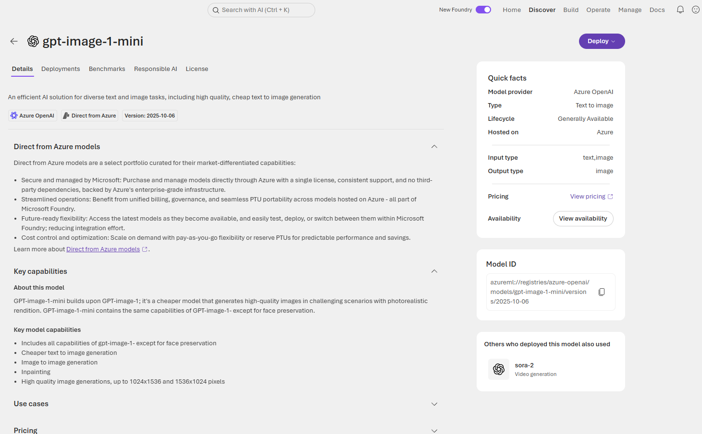
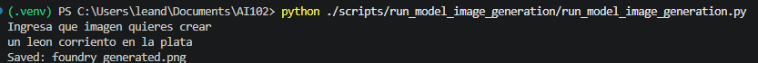
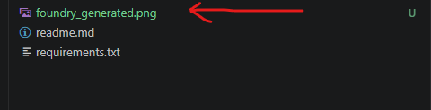
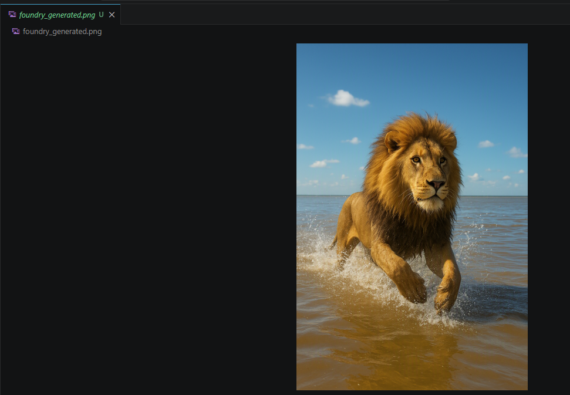

# Execute run_model_image_generation

## Deploy Model


Look for Model gpt-image-1-mini




Deploy Model gpt-image-1-mini



## Excute Script

```
python ./scripts/run_model_image_analysis/run_model_image_generation.py
```

Expected result should look like this if option selected is "leon"




Image was creted in the folder structure




Image created for input "leon corriento en la plata"





